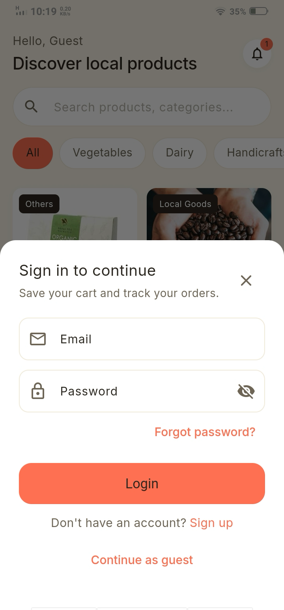
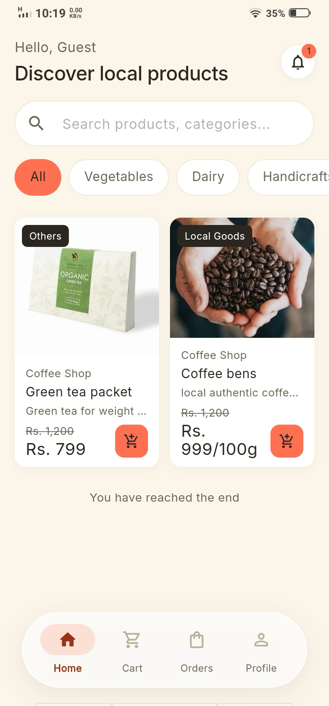
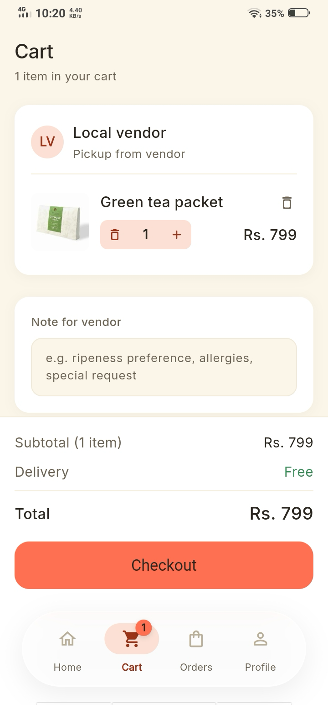
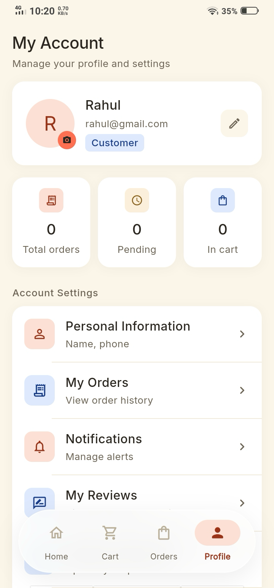
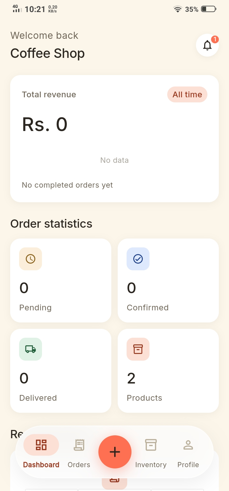
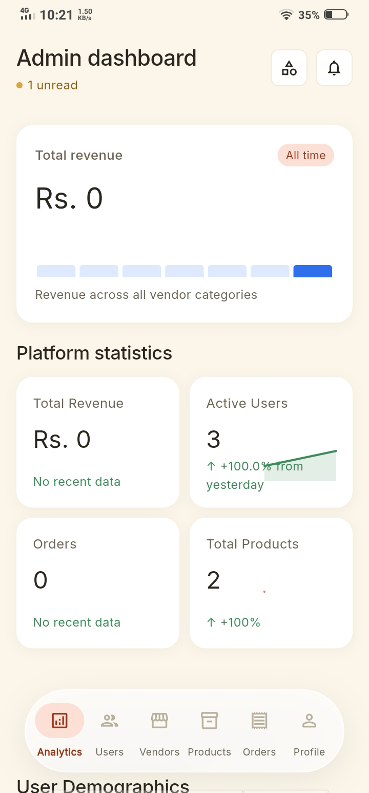

<div align="center">

# LocalTrade

**Nepal's community marketplace — connecting local producers directly with their community**

[](https://flutter.dev)
[](https://dart.dev)
[](https://nodejs.org)
[](https://expressjs.com)
[](https://www.mongodb.com)
[](LICENSE)

[](https://github.com/Theani7/LocalTrade/actions/workflows/backend-ci.yml)
[](https://github.com/Theani7/LocalTrade/actions/workflows/flutter-build.yml)
[](https://github.com/Theani7/LocalTrade/releases)

</div>

LocalTrade is a full-stack mobile marketplace platform that connects local producers — vegetable sellers, handicraft makers, dairy farmers, tailors, and bakers — directly with their community through a reservation-based ordering system. Built for Nepal's micro and small businesses.

## Table of Contents

- [Screenshots](#screenshots)
- [Features](#features)
- [Tech Stack](#tech-stack)
- [Project Structure](#project-structure)
- [Getting Started](#getting-started)
  - [Prerequisites](#prerequisites)
  - [Backend Setup](#backend-setup)
  - [Frontend Setup](#frontend-setup)
  - [Web Development (Chrome)](#web-development-chrome)
  - [Building the App](#building-the-app)
- [Testing](#testing)
- [CI/CD and Releases](#cicd-and-releases)
- [API Overview](#api-overview)
- [Useful Commands](#useful-commands)
- [Design System](#design-system)
- [Contributing](#contributing)
- [License](#license)

## Screenshots

| Login | Home | Cart | Profile |
|:---:|:---:|:---:|:---:|
|  |  |  |  |

| Vendor Dashboard | Admin Dashboard |
|:---:|:---:|
|  |  |

## Features

### Customer
- Browse products by category with search and filtering
- Product detail view with image carousel, pricing units (kg, piece, liter, etc.), and quantity stepper
- Shopping cart with animated add-to-cart effect
- Checkout with saved delivery addresses and order notes
- Order tracking with real-time status updates and ETA
- Order cancellation with feedback prompt
- Vendor shop pages
- Reviews and ratings on delivered products
- Push notifications (Firebase Cloud Messaging)
- In-app update checks via GitHub Releases
- Help & Support and Privacy Policy screens

### Vendor
- Dashboard with sales analytics, order stats, and revenue overview
- Product management with multi-image upload (up to 5 images via Cloudinary)
- Flexible pricing units: piece, kg, 100g, liter, dozen, packet, bundle
- Minimum order quantity per product
- Inventory management with stock tracking
- Order management with status updates (Confirm, Process, Ship, Deliver)
- Vendor profile and business information
- Pending-approval status screen with progress tracker

### Admin
- Platform overview dashboard with real-time analytics and stat tiles
- Vendor management: approve, suspend, reject
- Product moderation: view, deactivate, delete
- Order oversight with status tracking
- Dynamic category management (CRUD + reordering)
- User management and feedback results
- Analytics export (CSV)
- Companion React web dashboard for the admin role

### Shared
- Role-based authentication (Customer, Vendor, Admin) with JWT
- Push notifications via Firebase Cloud Messaging
- Standardized bottom navigation across roles
- Shared design system (buttons, status badges, product cards, skeleton loaders)
- Micro-animations with reduce-motion support

## Tech Stack

| Layer | Technology |
|-------|-----------|
| Mobile | Flutter 3.x, Dart, Provider (state management) |
| Admin Web | React, Vite, Recharts, Lucide Icons (Firebase Hosting) |
| Backend | Node.js 20, Express 5, Mongoose 9 |
| Database | MongoDB Atlas |
| Auth | JWT with bcrypt password hashing |
| Image Storage | Cloudinary |
| Push Notifications | Firebase Cloud Messaging |
| Testing | Jest + Supertest + mongodb-memory-server |
| CI/CD | GitHub Actions (tests, builds, releases) |
| Backend Hosting | Render |

## Project Structure

```
├── backend/                    # Node.js/Express REST API
│   ├── src/
│   │   ├── controllers/        # Request handlers
│   │   ├── models/             # Mongoose schemas
│   │   ├── routes/             # API route definitions
│   │   ├── middleware/         # Auth, upload, error handling
│   │   ├── config/             # DB, Cloudinary, Firebase config
│   │   └── utils/              # Shared helpers
│   ├── tests/                  # Jest + Supertest suites
│   ├── seed-*.js               # Admin/category/data seeding scripts
│   └── .env.example            # Environment variable template
├── frontend/localtrade_app/    # Flutter mobile app
│   ├── lib/
│   │   ├── core/               # Constants, theme, network, models, utils
│   │   ├── features/           # Screens grouped by role (auth, customer, vendor, admin)
│   │   ├── providers/          # Provider state management
│   │   └── widgets/            # Shared UI components
│   └── android/                # Android build config, keystore, notification icons
├── admin_web/                  # React web admin dashboard
├── screenshots/                # README screenshots
├── .github/workflows/          # GitHub Actions CI/CD
├── DESIGN_LANGUAGE.md          # Design system specification
└── render.yaml                 # Render deployment blueprint
```

## Getting Started

### Prerequisites

- Node.js 20+ and npm
- Flutter 3.x (stable channel) with Dart SDK
- MongoDB Atlas account
- Cloudinary account
- Firebase project (push notifications; optional for local development)

### Backend Setup

```bash
cd backend
cp .env.example .env        # Fill in your credentials (see .env.example)
npm install

node seed-admin.js           # Create the default admin user (from .env)
node seed-categories.js      # Seed 10 default product categories
node seed-data.js            # Optional: populate sample vendors + products

npm run dev                  # Start dev server on http://localhost:5000
```

### Frontend Setup

```bash
cd frontend/localtrade_app
flutter pub get
flutter run                   # Connected device or emulator
```

### Web Development (Chrome)

Chrome is the primary development mode for this project.

```bash
flutter config --enable-web   # One-time setup if web is not enabled
flutter run -d chrome
```

Set the API base URL in `lib/core/constants/app_constants.dart`:

| Environment | Base URL |
|---|---|
| Android emulator | `http://10.0.2.2:5000/api/v1` |
| iOS simulator / Chrome | `http://localhost:5000/api/v1` |
| Production | `https://localtrade-backend-jg9l.onrender.com/api/v1` |

**Notes for web development:**
- Push notifications require the user to grant browser permission; the app works without them.
- Firebase initialization is skipped gracefully if `firebase_options.dart` is missing.
- The in-app update flow (APK download/install) is Android-only; on web the changelog is shown but no download is offered.
- CORS is enabled on the production backend.

### Building the App

```bash
cd frontend/localtrade_app
flutter build apk --release --split-per-abi   # Signed split APKs (arm64-v8a, armeabi-v7a, x86_64)
flutter build ios                             # iOS (macOS + Xcode)
```

## Testing

Backend tests use Jest + Supertest with an in-memory MongoDB server — no external database required.

```bash
cd backend
npm test                   # Run all test suites
npm run test:watch         # Watch mode
```

Coverage: authentication, product CRUD, order lifecycle, reviews, and address handling.

## CI/CD and Releases

GitHub Actions automates the entire pipeline (see `.github/workflows/`):

| Workflow | Trigger | What it does |
|---|---|---|
| `backend-ci.yml` | Push/PR touching `backend/` | Runs the Jest test suite |
| `flutter-build.yml` | Push touching `frontend/`, manual dispatch | Runs `flutter analyze`, builds signed split APKs, uploads artifacts |
| `release-apk.yml` | Push of a `v*` tag | Builds signed + obfuscated split APKs, publishes a GitHub Release |

**To ship a release:**

1. Bump the version in `frontend/localtrade_app/pubspec.yaml` (e.g. `2.4.0+14`)
2. Push the changes, then create and push a matching tag:

```bash
git tag v2.4.0+14 && git push origin v2.4.0+14
```

The release workflow builds the APKs, attaches them to a GitHub Release with auto-generated notes, and stores obfuscation debug symbols as a CI artifact. Users update through the in-app update checker, which downloads the APK matching their device architecture.

## API Overview

All endpoints are prefixed with `/api/v1`.

### Authentication
| Method | Endpoint | Access |
|--------|----------|--------|
| POST | `/auth/register` | Public |
| POST | `/auth/login` | Public |
| POST | `/auth/forgot-password` | Public |
| POST | `/auth/verify-otp` | Public |
| PATCH | `/auth/reset-password-with-otp` | Public |
| GET | `/auth/me` | Authenticated |
| PATCH | `/auth/profile` | Authenticated |
| PATCH | `/auth/change-password` | Authenticated |
| PATCH | `/auth/force-change-password` | Authenticated (first login) |
| PATCH | `/auth/update-fcm-token` | Authenticated |

### Products
| Method | Endpoint | Access |
|--------|----------|--------|
| GET | `/products` | Public |
| GET | `/products/:id` | Public |
| GET | `/products/vendors/:id/profile` | Public |
| GET | `/products/my-products` | Vendor |
| POST | `/products` | Vendor |
| PATCH | `/products/:id` | Vendor / Admin |
| PATCH | `/products/:id/stock` | Vendor / Admin |
| DELETE | `/products/:id` | Vendor / Admin |
| GET | `/products/:id/deletable` | Vendor / Admin |

### Orders
| Method | Endpoint | Access |
|--------|----------|--------|
| POST | `/orders` | Customer |
| GET | `/orders/my-orders` | Customer |
| GET | `/orders/vendor-orders` | Vendor |
| GET | `/orders/:id` | Authenticated |
| PATCH | `/orders/:id/status` | Vendor / Admin |
| PATCH | `/orders/:id/cancel` | Customer / Admin |

### Reviews
| Method | Endpoint | Access |
|--------|----------|--------|
| GET | `/reviews` (filter by `productId`) | Public |
| GET | `/reviews/my-reviews` | Customer |
| POST | `/reviews` | Customer (delivered order required) |
| PATCH | `/reviews/:id` | Customer (owner) |
| PATCH | `/reviews/:id/reply` | Vendor / Admin |
| DELETE | `/reviews/:id` | Customer (owner) / Admin |

### Categories
| Method | Endpoint | Access |
|--------|----------|--------|
| GET | `/categories` | Public |
| GET | `/categories/admin` | Admin |
| POST | `/categories` | Admin |
| PATCH | `/categories/reorder` | Admin |
| PATCH | `/categories/:id` | Admin |
| DELETE | `/categories/:id` | Admin |

### Notifications
| Method | Endpoint | Access |
|--------|----------|--------|
| GET | `/notifications` | Authenticated |
| PATCH | `/notifications/:id/read` | Authenticated |
| PATCH | `/notifications/mark-all-read` | Authenticated |
| DELETE | `/notifications/:id` | Authenticated |

### Vendor
| Method | Endpoint | Access |
|--------|----------|--------|
| GET | `/vendor/analytics` | Vendor |
| GET | `/vendor/profile` | Vendor |
| PATCH | `/vendor/profile` | Vendor |

### Feedback
| Method | Endpoint | Access |
|--------|----------|--------|
| POST | `/feedback` | Authenticated |
| GET | `/feedback` | Admin |

### Admin
| Method | Endpoint | Access |
|--------|----------|--------|
| GET | `/admin/analytics` | Admin |
| GET | `/admin/analytics/export` | Admin (CSV) |
| GET | `/admin/users` | Admin |
| PATCH | `/admin/users/:id/toggle-status` | Admin |
| GET | `/admin/vendors` | Admin |
| GET | `/admin/vendors/:id` | Admin |
| PATCH | `/admin/vendors/:id/status` | Admin |
| GET | `/admin/products` | Admin |
| GET | `/admin/products/:id` | Admin |
| GET | `/admin/orders` | Admin |
| DELETE | `/admin/products/:id` | Admin |

## Useful Commands

| Command | Location | Description |
|---------|----------|-------------|
| `npm run dev` | backend | Start dev server (nodemon) |
| `npm test` | backend | Run tests (in-memory MongoDB) |
| `npm run clear:data` | backend | Reset non-admin data |
| `node seed-admin.js` | backend | Create/update admin user |
| `node seed-categories.js` | backend | Seed default categories |
| `node seed-data.js` | backend | Seed sample vendors + products |
| `flutter run` | frontend | Run app on connected device |
| `flutter run -d chrome` | frontend | Run app on Chrome (web) |
| `flutter analyze` | frontend | Static analysis / lint |
| `flutter build apk --release --split-per-abi` | frontend | Build signed split APKs |

## Design System

The app follows a consistent design language documented in [`DESIGN_LANGUAGE.md`](DESIGN_LANGUAGE.md) and [`localtrade-design-system-revised.md`](localtrade-design-system-revised.md):

- **Colors:** Cream background (`#FBF5EA`), coral accents (`#FF6F52`), high-contrast ink text
- **Typography:** Inter/Noto Sans, 400/500 weights, sentence case
- **Cards:** 16px radius, soft shadows, 12-18px padding
- **Touch targets:** 44px minimum, 52px for primary actions
- **Animations:** 150-400ms durations, staggered lists, reduce-motion support

## Contributing

Contributions are welcome. To contribute:

1. Fork the repository
2. Create a feature branch (`git checkout -b feat/your-feature`)
3. Commit your changes following [Conventional Commits](https://www.conventionalcommits.org) (`feat(scope): description`)
4. Push and open a pull request against `main`

Please ensure `flutter analyze` and `npm test` pass before submitting.

## License

Distributed under the [MIT License](LICENSE).
