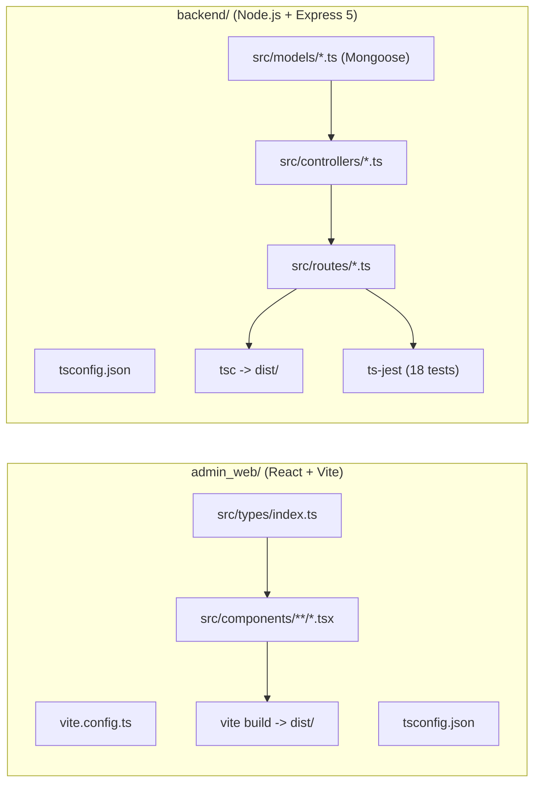

# TypeScript Migration Design Specification

- **Date**: 2026-08-19
- **Status**: Approved
- **Scope**: Migration of `admin_web` (React + Vite) and `backend` (Node.js + Express 5) from JavaScript to TypeScript, with automated regression and verification checks.

---

## 1. Overview & Goals

The objective is to migrate all JavaScript code in the LocalTrade repository to strongly typed TypeScript, enhancing maintainability, developer ergonomics, and preventing runtime type-related regressions across both the admin dashboard and the core API.

### Success Criteria
1. `admin_web` is fully converted to TypeScript (`.tsx` / `.ts`), building cleanly via Vite and passing `tsc --noEmit` with 0 type errors.
2. `backend` is fully converted to TypeScript (`.ts`), compiling cleanly to `dist/`, running with `tsx` in development, and serving production traffic from `dist/server.js`.
3. All backend unit/integration tests (18 tests across 5 test suites) run seamlessly using `ts-jest` and pass with 0 failures.
4. API response shapes, error contracts, status codes, and database operations remain 100% backward compatible with both the Flutter mobile app and Admin Web dashboard.
5. A dedicated verification agent tests builds, type checks, and performs smoke verification to guarantee zero functional regressions.

---

## 2. Architecture & Tech Stack

---

## 3. Phase 1: Admin Web Migration (`admin_web/`)

### 3.1 Project Configuration
- **Dependencies**: Add `typescript`, `@types/react`, `@types/react-dom`, `@types/node` (as dev dependencies).
- **TypeScript Configuration**:
  - `tsconfig.json`: Target `ES2022`, module `ESNext`, `moduleResolution: bundler`, `jsx: react-jsx`, `strict: true`, `skipLibCheck: true`.
  - `tsconfig.node.json`: Configuration for Vite configuration and tooling.
- **Entry & Build**:
  - Convert `vite.config.js` -> `vite.config.ts`.
  - Update `index.html` script tag to reference `/src/main.tsx`.
  - Convert `src/main.jsx` -> `src/main.tsx`.
  - Add npm script: `"typecheck": "tsc --noEmit"`.

### 3.2 Type Definitions (`admin_web/src/types/index.ts`)
Define interfaces for all dashboard data structures:
- `User`: Base user model (`_id`, `fullName`, `email`, `phone`, `role`, `isActive`, `createdAt`).
- `Vendor`: Vendor extension (`shopName`, `businessDescription`, `vendorApprovalStatus`, `productCount`, `categories`).
- `Product`: Product model (`_id`, `title`, `description`, `category`, `price`, `originalPrice`, `priceUnit`, `stockQuantity`, `images`, `ratingsAverage`, `ratingsQuantity`, `vendorId`).
- `Order`: Order model (`_id`, `customerId`, `vendorId`, `products`, `totalAmount`, `orderStatus`, `createdAt`).
- `Category`: Category model (`_id`, `name`, `icon`, `isActive`, `sortOrder`).
- `AnalyticsData`: Strongly typed analytics stats, daily trends, user trends, revenue by category, and recent orders.
- `NotificationItem`, `FeedbackItem`, `TabType`, `DetailViewState`, `ConfirmModalState`, `CategoryModalState`.

### 3.3 Component Architecture & Decomposition
Refactor the single monolithic `App.jsx` (~1100 lines) into modular typed components under `src/components/`:
- `components/common/`: `NavItem.tsx`, `StatCard.tsx`, `MiniStatCard.tsx`, `PaginationFooter.tsx`, `ConfirmModal.tsx`, `CategoryModal.tsx`, and skeleton loaders (`AnalyticsSkeleton.tsx`, `TableSkeleton.tsx`, `DetailSkeleton.tsx`).
- `components/tabs/`: `AnalyticsTab.tsx`, `UsersTab.tsx`, `VendorsTab.tsx`, `ProductsTab.tsx`, `OrdersTab.tsx`, `CategoriesTab.tsx`, `FeedbackTab.tsx`, `ProfileTab.tsx`.
- `components/details/`: `VendorDetail.tsx`, `ProductDetail.tsx`, `OrderDetail.tsx`.
- `App.tsx`: Main dashboard layout, navigation state, search queries, notifications drawer, and tab router.

---

## 4. Phase 2: Backend Migration (`backend/`)

### 4.1 Project Configuration & Toolchain
- **Dependencies**: Add `typescript`, `@types/node`, `@types/express`, `@types/cors`, `@types/morgan`, `@types/multer`, `@types/bcryptjs`, `@types/jsonwebtoken`, `@types/jest`, `@types/supertest`, `tsx` (dev execution), `ts-jest` (test runner).
- **TypeScript Configuration (`tsconfig.json`)**:
  - `target: "ES2022"`, `module: "CommonJS"`, `moduleResolution: "Node"`, `outDir: "./dist"`, `rootDir: "./src"`, `strict: true`, `esModuleInterop: true`, `skipLibCheck: true`.
- **Scripts in `package.json`**:
  - `"dev": "tsx watch src/server.ts"`
  - `"build": "tsc"`
  - `"start": "node dist/server.js"`
  - `"test": "cross-env NODE_ENV=test jest --runInBand --detectOpenHandles"`
  - `"typecheck": "tsc --noEmit"`
  - `"seed:admin": "tsx seed-admin.ts"`
  - `"clear:data": "tsx clear-data.ts"`
- **Render / CI Blueprint Compatibility**:
  - Ensure `render.yaml` or build command executes `npm run build && npm start`.
  - Ensure `.github/workflows/backend-ci.yml` runs `npm test` against TypeScript files.

### 4.2 Backend Type Definitions & Models (`src/models/*.ts`)
Define Mongoose Document interfaces and Model schemas:
- `IUserDocument` (`fullName`, `email`, `password`, `phone`, `role`, `vendorApprovalStatus`, `mustChangePassword`, `address`, `shopName`, `fcmToken`, `isActive`, `comparePassword`).
- `IProductDocument` (`title`, `description`, `category`, `price`, `originalPrice`, `priceUnit`, `minOrder`, `images`, `vendorId`, `vendorName`, `location`, `stockQuantity`, `productStatus`, `ratingsAverage`, `ratingsQuantity`).
- `IOrderDocument` (`customerId`, `vendorId`, `products`, `totalAmount`, `orderStatus`, `shippingAddress`, `notes`, `cancellationReason`).
- `ICategoryDocument`, `IReviewDocument`, `INotificationDocument`, `IFeedbackDocument`.

### 4.3 Request / Response & Middleware Typing
- `src/types/express.d.ts`: Extend `Express.Request` to include optional `user?: IUserDocument`.
- `catchAsync.ts`: Type safe async route wrapper supporting Express 5 error propagation.
- `appError.ts`: Typed application error class inheriting from `Error` with `statusCode` and `isOperational`.

### 4.4 Test Suite (`backend/tests/*.test.ts`)
- Update `jest.config.js` with `preset: 'ts-jest'`.
- Convert `tests/setup.js` -> `tests/setup.ts`.
- Convert all test suites (`auth.test.ts`, `product.test.ts`, `order.test.ts`, `review.test.ts`, `authAddressTest.test.ts`).

---

## 5. Verification & Parity Testing Strategy

A dedicated verification agent will execute a 4-step quality gate:
1. **Static Typecheck**:
   - `npm run typecheck` in `admin_web` (0 errors)
   - `npm run typecheck` in `backend` (0 errors)
2. **Production Bundle Verification**:
   - `npm run build` in `admin_web` (generates valid bundle in `dist/`)
   - `npm run build` in `backend` (generates runnable JS in `dist/`)
3. **Automated Test Suite**:
   - `npm test` in `backend` (all 18 tests passing with MongoDB Memory Server)
4. **Smoke & API Parity Audit**:
   - Validate auth endpoints, response formats, and error payload structures against expected contracts.

---

## 6. Implementation Sequence

1. **Step 1: Admin Web TypeScript Setup & Conversion**
   - Install TS dependencies & configure `tsconfig.json`.
   - Create `types/index.ts`.
   - Modularize and convert `App.jsx` + components into typed `.tsx` files.
   - Verify `npm run typecheck` and `npm run build`.
2. **Step 2: Backend TypeScript Setup & Model Interfaces**
   - Install backend TS dependencies & configure `tsconfig.json` and `jest.config.js`.
   - Convert models and utilities into strongly typed modules.
3. **Step 3: Backend Controllers, Routes, and Server Migration**
   - Convert controllers, middleware, routes, and `app.ts` / `server.ts`.
   - Convert seed scripts and test suites.
4. **Step 4: Full Verification & CI Integration**
   - Run verification agent to test all test suites, builds, and type checkers.
   - Commit and push to GitHub.
